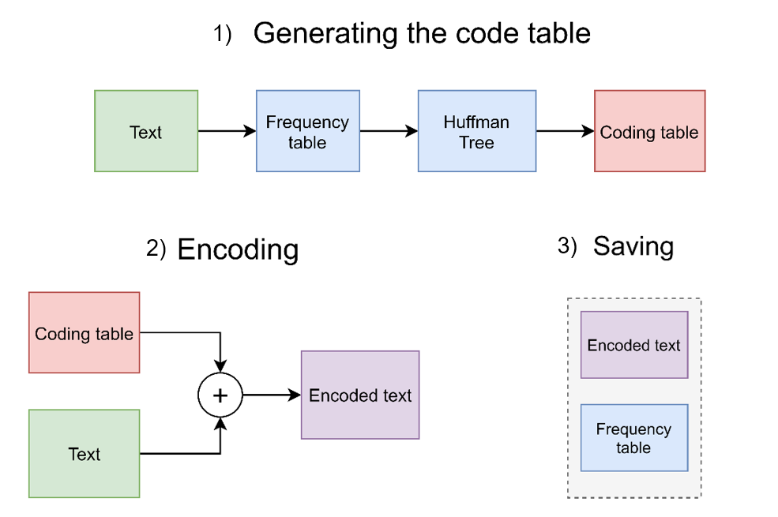
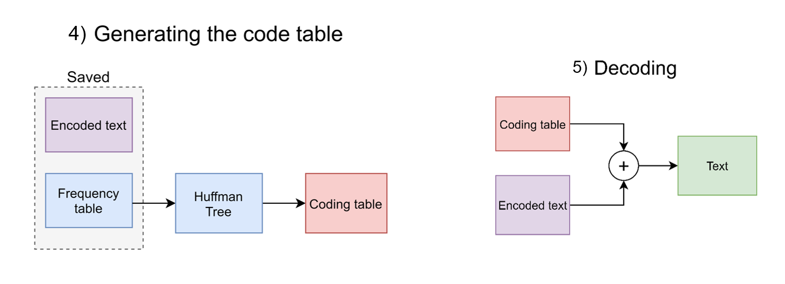
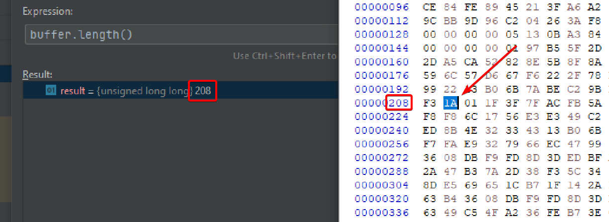

# Compression: Huffman coding and the LZW algorithm
## Dec. 2023

**Overview:**
```text
Content:
+ 1. Introduction
+ 2. Design overview
+ 3. Huffman coding
    - 3.1 Introduction
    - 3.2 Theory behind the algorithm
    - 3.3 Implementation in the program
        - 3.3.1 Program overview
        - 3.3.2 Frequency table: counting letters
        - 3.3.3 Building the tree
        - 3.3.4 Decoding table: tree traversal
        - 3.3.5 Encoding
        - 3.3.6 Decoding
+ 4. The LZW (Lempel–Ziv–Welch) algorithm
    - 4.1 Introduction
    - 4.2 Theory behind the algorithm
    - 4.3 Implementation in the program
        - 4.3.1 Program overview
        - 4.3.2 Encoding
        - 4.3.3 Decoding
+ 5. File handling
+ 6. Benchmarking
+ 7. Reflection
+ 8. References
```

## 1. Introduction

The purpose of the assignment is implementing the compression and decompression of files using the 
Huffman coding algorithm and the LZW (Lempel–Ziv–Welch) algorithm.
The learning objectives are to implement both these algorithms, and a simple program to encode and decode
text files in order to test these algorithms.

The core subject of this assignment is compression. Compression is the process of reducing the size of a file by 
encoding information in a more efficient way. It removes redundant or unnecessary data, allowing the file to take up 
less storage space. These savings are essential for systems that consist out of millions of files, or for applications
where storage space may be limited such as for data transmission.
Compression is at its core about finding patterns and redundancy within data and reducing these 
redundancies. Both to-be-covered algorithms are lossless, which means that no information may be lost after a cycle of 
compression and decompression. 


## 2. Design Overview

Below is an image of the total program developed for this assignment. The program contains:

- Two algorithms (LZW and Huffman) for compressing and decompressing files
- A file handler to manage opening, reading and writing binary to/from files
- An encompassing compression handling class that incorporates all the above elements into simple to use functions.


<div style="display: flex">

</div>
<div style="text-align: center;">
Figure 1: UML Overview of the program (public methods only)
</div>


## 3. Huffman coding
### 3.1 Introduction
Huffman coding is an algorithm that efficiently assigns variable-length codes to different characters in a text file, 
where more frequent characters receive shorter codes, reducing overall space while retaining the original information.

The downside of this algorithm is that the data used to encode the text has to be included with the encoded text in order 
to be able to decode it. This is a permanent overhead that leads to worse compression ratios for smaller files.

### 3.2 Theory behind the algorithm

Compressing a file using Huffman coding works as follows:

1. _Building the frequency table_: The algorithm starts by analyzing the text to determine the frequency of 
each character. Each character will get assigned a unique code depending on their frequency.
More frequent characters will be assigned a shorter code, and less frequent ones will have longer codes.


2.  _Building the Huffman tree_: After building the frequency table, a tree is built using an 
algorithm that walks through the frequency table and merges the two least frequent characters at each step until all characters are merged and form a 
single tree. 


3. _Building the coding table_: Once the Huffman tree is built, each character in the tree (leaf nodes) receives a unique binary code. 
These codes are derived by traversing the tree from the root to each character, assigning '0' for the left branch and '1' 
for the right branch.


4. _Encoding the text_: With the codes assigned, the original data is then encoded by replacing each character with its corresponding 
Huffman code. This compressed representation is smaller than the original data, especially when frequent characters are 
represented by shorter codes. The resulting encoded text has either the coding table, huffman tree or frequency table included in order to decode the text.
In this implementation the frequency table was chosen.

<div style="display: flex">

</div>
<div style="text-align: center;">
Figure 2: Steps for Huffman encoding and saving
</div>&nbsp

Decoding is simply the same process in reverse if the frequency table is included, or in the case the coding table is included
the text can immediately be decoded.

- Decoding with the frequency table: Using the included frequency table, the Huffman tree is built. The tree is then traversed
according to the "instructions" in the encoded data. The encoded data essentially forms a route from the root of the tree to a leaf node.
Each 0 is a left turn and each 1 is a right turn. The letter corresponding to the leaf node at the end destination is the decoded letter.


- Decoding with the coding table: This is a direct approach that doesn't require rebuilding the tree, at the cost of
extra overhead that has to be saved with the encoded data. The encoded data can simply be read out and compared with
the codes in the coding table, and decoded.

<div style="display: flex">

</div>
<div style="text-align: center;">
Figure 3: Steps for Huffman decoding
</div>&nbsp

In order to get consistent encoding and decoding results, some extra rules may be put in place that aren't necessarily
part of the Huffman algorithm, such as ordering equal weighted leaf nodes alphabetically when constructing the tree.
These rules are implementation dependent, therefore the exact implementation must be known in order to decode a Huffman
encoded text.


#### Example tree:

Below is an example tree for the word "programming". The blue nodes are root nodes that include the sum
of the total frequencies of all its child nodes. The purple leaf nodes are the characters with their frequency. 

When traversing the tree, a left branch is a '0' and a right branch is a '1'.

The code for each character is the path traversed from the top tree root to a leaf.

<div style="display: flex">

</div>
<div style="text-align: center;">
Figure 4: Generated tree and code table for the word Programming
</div>

### 3.3 Implementation in the program
#### 3.3.1 Program overview
The Huffman coding part of the program consists of the following classes:
- _Huffman_coder_: Generates the frequency table from a passed string, and encodes/decodes this string using the coding table generated by Tree.

- _Tree_: Builds a tree out of a passed frequency table, then returns the coding table generated from traversing the tree using a recursive pathing function.

The activity diagram below shows the interaction between both classes during encoding and decoding.

<div style="display: flex">

</div>
<div style="text-align: center;">
Figure 5: Activity diagram of Huffman_coder and Tree
</div>

#### 3.3.2 Frequency table: counting letters

The tree will be built out of nodes. Each node needs to be able to contain both the frequency and a character. The node also contains
pointers to its left or right children (if they exist). This allows us to construct a tree out of them.

If it's a root node that only contains a frequency of its children, the character will be set to the reserved symbol '~'.

```c++
    // Min heap node in the huffman tree
    struct Node {
        int freq;
        char data;
        Node *left{nullptr};
        Node *right{nullptr};

        Node(char data, int freq) {
            this->freq = freq;
            this->data = data;
        }
    };
```


Since nodes allow us to save characters and their frequency, and have all the necessary infrastructure to build a tree from later, 
they're also a good medium to build the frequency table with. To be able to build this frequency table, we need to be able to 
convert a string of text to nodes. The following function delivers that.

In short it does the following:

1) Copy the string into a map to get each character and its frequency
2) Copy the map into a vector of <char, int> pairs, to allow sorting it by frequency
3) Convert the by-frequency sorted vector of pairs into a vector of nodes
4) Return above mentioned vector of nodes
```c++
  std::vector<Node> Huffman_coder::string_to_nodes(const std::string &text_str) {
  /// Count the frequency of each character, output map is sorted alphabetically first
        std::map<char, int> freq_map; // Holds a map of each character and its frequency, sorted alphabetically
        std::vector<std::pair<char, int>> freq_sorted{}; // Sorted by-frequency vector copy of the map
        std::vector<Node> nodes{}; // Vector of nodes (frequency table) that gets returned

        // Traverse the string
        for (int i{0}; text_str[i]; i++) {
            // If the current character hasn't been found before, set frequency to 1
            if (freq_map.find(text_str[i]) == freq_map.end()) {
                freq_map.insert(std::make_pair(text_str[i], 1));
            } else {
                // If the character already exists in the map, increase the frequency
                freq_map[text_str[i]]++;
            }
        }
        
    /// Now re-sort by frequency

        // Copy map into vector
        for (auto &it: freq_map) {
            freq_sorted.push_back(it);
        }

        // Sort by frequency
        std::sort(freq_sorted.begin(), freq_sorted.end(), cmp_map_sort);
        
    /// Convert sorted vector to nodes and add them to nodes vector
        for (auto &it: freq_sorted) {
            Node temp(it.first, it.second);
            nodes.push_back(temp);
        }

        return nodes;
  }
```

#### 3.3.3 Building the tree

Now we have the frequency table, we can build a tree from it. We do this with a min-heap.


Initialized in class:
```c++
// Min priority queue (min heap) used for building and storing the Huffman tree
        std::priority_queue<Node *, std::vector<Node *>, Node_compare> min_heap{};
```

In case the min-heap still has contents from a previously generated tree, it is cleared first. After that the contents of the frequency table are pushed into the min-heap.

```c++
    void Tree::add_freq_table(const std::vector<Node> &n) {
        // Wipe current contents of min heap (tree)
        clear_min_heap();

        // Add new freq_table to min_heap
        for (auto i: n) {
            min_heap.push(new Node(i.data, i.freq));
        }
        build_tree();
    }
```

We can now construct a tree from the contents of the min-heap. We do this by constructing it inside this same heap. Because 
the nodes in the std::vector of nodes (the frequency table) were already sorted by frequency, we can easily build a Huffman tree out of them.

We do this the following way for as long as the min-heap has unconnected nodes:

1) Extract the 2 lowest frequency nodes from the heap
2) Make a new root node with its frequency being the sum of these 2 extracted nodes (set to reserved character '~')
3) Connect the 2 lowest frequency nodes to this new root node, 
4) Push this new root node with the 2 lowest frequency nodes connected back into the min heap.

By repeating this we will slowly build a tree from the nodes in the min-heap until everything is connected.

```c++
    void Tree::build_tree() {
        // Iterate while heap has loose nodes
        while (min_heap.size() > 1) {
            // Extract the 2 lowest freq items from heap
            left = min_heap.top();
            min_heap.pop();

            right = min_heap.top();
            min_heap.pop();

            // Add a new root node to these two nodes with the frequency being the sum of the frequency of both left and right children
            // '~' character reserved for indicating the root node
            root = new Node('~', left->freq + right->freq);
            root->left = left;
            root->right = right;

            // Push new tree part back into the min heap
            min_heap.push(root);
        }
    }
```

#### 3.3.4 Decoding table: tree traversal

Now the tree is built, we need to be able to find the code for each character in the tree. As explained before, the code 
for each character is the path traversed from the top tree root to a leaf. For this we use a recursive pathing function 
that will path through the tree. The function keeps passing a string to itself where it will add either a "0" or "1" to depending on whether
it has taken a left or right turn at each node.

```c++
    void Tree::coding_table_from_node(Node *n, const std::string& code_recursive, std::map<char, std::string> &coding_table) {
        // If null, we've reached the end, break from recursion
        if (n == nullptr) {
            return;
        }

        // Only output if it's not a root node
        if (n->data != '~') {
            coding_table.insert(std::make_pair(n->data, code_recursive));
        }

        coding_table_from_node(n->left, code_recursive + "0", coding_table); // Left child, add a 0 to the code
        coding_table_from_node(n->right, code_recursive + "1", coding_table); // Right child, add 1 to the code
    }
```

In order to decode the tree, we need to pass the recursive function the start (root), an empty string it can use
to build the code in, and a std::map it can use to build the coding table.

```c++
    std::map<char, std::string> Tree::return_coding_table() {
        std::map<char, std::string> temp_coding_table{};
        coding_table_from_node(root, "", temp_coding_table);

        return temp_coding_table;
    }
```

#### 3.3.5 Encoding

Now we have the coding table for the original string, we can encode it. This is done by looking up the code that
belongs to each character in the original string with the coding table.

```c++
    std::string Huffman_coder::code_with_coding_table(const std::string &text_str,
                                                      const std::map<char, std::string> &coding_table) {

        std::string coded{};

        for (auto i: text_str) {
            coded.append(coding_table.find(i)->second);
        }

        return coded;
    }
```

We can now write the binary representing string (a string where each bit is a character '1' or '0') and the frequency table of the original text to a file. For this a function 
is used to be able to write the binary of the coded string to file. The exact way this is done is a detail that's not
crucial for understanding the concept of this algorithm, but was a large challenge in implementation regardless.

#### 3.3.6 Decoding

For decoding we get the frequency table that was included with the encoded data to do the above steps again to generate the coding table.
It's important to mention that since Huffman coding works with arbitrary length, it's possible the last code written
to a file is shorter than a byte. Therefore, the information about the total length of the original string is lost during
encoding. Luckily we write the total length of the original file inside the frequency table that's included with the
encoded data. When opening a file and converting it back to a binary representing string, this saved length is used
to get back exactly the data that was encoded, without extra trailing zeroes from trying to fit it into a byte.

Once we have the encoded data back, we decode by reading the encoded data bit by bit and checking if the current sequence 
of bits is a code that exists in the coding table. We repeat this until we have read all encoded data.

```c++
    std::string Huffman_coder::decode_with_coding_table(std::string encoded_text_str,
                                                        const std::map<char, std::string> &coding_table) {

        std::string read_buffer{};
        std::string output_string{};
        auto reversed_table = reverse_map(coding_table);

        // We will copy an element from encoded_text_str to read_buffer, then remove it from the encoded_text_str
        // Read_buffer will be checked to the coding table:
        // If the contents of read_buffer are equal to the code of a character from the coding table,
        // then the corrresponding character will be added to the output string and read_buffer will be wiped
        // This will continue until encoded_text_str is empty;

        // add a code number to the buffer until it is something that exists inside the coding table
        while (!encoded_text_str.empty()) {
            read_buffer.push_back(encoded_text_str.front()); // Add front element of encoded text to read buffer

            encoded_text_str.erase(encoded_text_str.begin()); // delete front element from encoded text

            // Check if the code contents of read buffer correspond to a character in the map
            // map.find() returns the end iterator if nothing is found

            // If the value exists
            if (reversed_table.find(read_buffer) != reversed_table.end()) {

                // add the corresponding character of the code to the output string
                output_string.push_back(reversed_table.find(read_buffer)->second);

                // Wipe the read_buffer
                read_buffer.clear();
            }
        }

        if (!read_buffer.empty()) {
            std::cerr
                    << "read_buffer wasn't empty, therefore a character was in the decoding string that wasn't encoded in the coding table!";
        }

        return output_string;
    }
```


## 4. The LZW (Lempel–Ziv–Welch) Algorithm
### 4.1 Introduction
The LZW (Lempel-Ziv-Welch) algorithm is a dictionary-based compression algorithm. It works by replacing sequences of data with codes, 
building a dictionary of these sequences as it walks through it. When it encounters a repeated sequence saved previously in the dictionary, 
it outputs the corresponding code. This method effectively reduces the size of the data by storing repeated patterns more efficiently.

What is meant by a "sequence of data" can be anything from words such as "the" which can appear hundreds of times
in a large text, to simply a small combination of letters such as "th", "ck" and "nk", which usually appear in many different words.
By encoding these with a single code that is less bits than the individual characters on their own, compression is attained.
This also means that the more unique sequences there are in an encoded text, the worse the compression will be, since it relies on repetition of sequences.
In the worst case, there is no compression at all. 

The largest advantage of LZW over Huffman is that the encoded data doesn't need any added frequency table or "code book" 
to decode it. The dictionary used to encode a file with LZW can be rebuilt while decoding it. 
This reduces the overhead significantly by eliminating the need to store extra data with the encoded text. It is also much faster
since no complex tree datastructures have to be generated.


### 4.2 Theory behind the algorithm

Compressing a file with LZW works as follows:

1. _Initialization_: The algorithm initializes a dictionary containing all 256 default ASCII characters. Each symbol takes a unique code which is equal to their position in the dictionary.


2. _Building the dictionary_: The algorithm scans the input data and looks for sequences of characters that repeat. When a sequence is found for the first time, it adds it to the dictionary and assigns it the next available position/code in the dictionary. It keeps doing this for subsequent sequences, updating the dictionary and generating new codes as needed.


3. _Encoding_: As the dictionary is being built, the resulting code for each sequence of characters is output to a file. This is the encoded file.


4. _Decoding_: To decode the compressed data, the receiver uses the same default initialized dictionary to decode the first (and therefore known) characters of the file. 
Since each subsequent sequence of characters is created from this known initial set, the entire dictionary can be rebuilt.


LZW's efficiency relies on its ability to create new codes for longer sequences of characters encountered,  reducing the overall size of the data.
Both encoder and decoder must use the same initial dictionary and follow the same rules for encoding/decoding to ensure the dictionary is constructed the same way each time.

Since the code for the encoded data takes the value of the position in the dictionary, the size of the dictionary determines
the level of compression possible. The dictionary is usually between 9 - 16 bits. This is also the number of bits
each "code" takes up in the compressed data.

This means that a larger dictionary allows more unique sequences of characters to be saved, therefore allowing more compression. However, for smaller files with very litle
repeating sequences of characters, using a large dictionary size will hurt the total attainable compression ratio.


### 4.3 Implementation in the program
#### 4.3.1 Program overview

The program is a quite standard implementation of the LZW algorithm. A notable limitation is that it works with
a non-dynamic dictionary. This means the size of the dictionary can't dynamically be adjusted as it grows. 
The size of the dictionary is set by LZW_CODED_MSG_BITS in lzw.h.
This limitation is due to the way conversion to binary is set up. This results in worse compression for smaller files
when LZW_CODED_MSG_BITS is set very high, or worse compression for bigger files when the number of bits is set too low.
An extra added to my implementation is that when the dictionary is full, the algorithm will continue encoding but only by 
looking up the entries in the dictionary.

The basic steps of the LZW algorithm are as follows:

**Encoding:**
1) First we initialize the dictionary with the default 0..255 ascii characters.
2) Find the longest entry in the dictionary that matches the current input.
3) Output the index of the longest entry and remove it from the input.
4) Add (longest entry + the next value) as a key in the next available spot in the dictionary
5) Repeat 2 to 4 until everything is encoded

**Decoding:**
1) First we initialize the dictionary with the default 0..255 ascii characters.
2) Read the next value and check if it is encoded in the dictionary.
   1) If it is not:
      1) Add the previous outputted entry to the current input
      2) Add the above to the dictionary and output it
   2) If it is:
      1) Output the matching entry in the dictionary
      2) Add the previous outputted entry to the current output, and add this to the dictionary.
3) Repeat 2 until everything is decoded


#### 4.3.2 Encoding

The implementation follows the above steps (mostly). Some extra checks are in place for example for checking if the dictionary is full.

```c++
    std::string LZW_coder::encode(const std::string &text_str) {
        std::map<std::string, int> dict{};
        int dict_size = 256;
        std::string coded_msg{};
        std::string first_input{}; // String because we need to be able to append characters: 't' + 'h' = "th"
        bool overflow_flag{false};

        // Build default dictionary
        for (int i{0}; i < dict_size; i++) {
            dict[std::string{(char) i}] = i;
        }

        // Encode the text_str
        for (int i{0}; i < text_str.length(); i++) {
            char next_input = text_str[i];

            // If first_input + next_input is in the dictionary
            if (dict.count(first_input + next_input)) {
                first_input += next_input;
            } else if (dict_size <= pow(2, LZW_CODED_MSG_BITS)) {
                // If dictionary isn't full and first_input + next_input is not in the dictionary
                
                // Output code
                coded_msg.append(int_to_binary_str(dict[first_input]));

                // Add first_input + next_input to the dictionary by setting new fake "ascii" value
                dict[first_input + next_input] = dict_size++;
                first_input = next_input;
            } else {
                // If the dictionary is full, stop filling it and encode the rest of the file using the current dictionary
                coded_msg.append(int_to_binary_str(dict[first_input]));
                first_input = next_input;
                if (!overflow_flag) {
                    std::cerr << "\nDictionary Overflow, increase LZW_CODED_MSG_BITS!";
                    overflow_flag = true;
                }
            }
        }

            // Print the last character
            if (!first_input.empty()) {
                coded_msg.append(int_to_binary_str(dict[first_input]));
            }

            return coded_msg;
        }
```

#### 4.3.3 Decoding

This implementation is also mostly identical to the theoretical implementation.

```c++
        std::string LZW_coder::decode(const std::string &encoded_text_str) {
            std::map<int, std::string> dict{};
            std::string first_input{};
            std::string decoded_msg{};
            std::string temp{};

            int dict_size = 256;

            // Convert binary string to lzw index where each int is the char value of the dictionary
            auto lzw_indexes = binary_string_to_lzw_indexes(encoded_text_str);

            // Build default dictionary
            for (int i{0}; i < dict_size; i++) {
                dict[i] = (char) i;
            }

            // Set initial conditions (first character is always known)
            first_input = dict[lzw_indexes[0]];
            decoded_msg = dict[lzw_indexes[0]];

            // Continue on and decode from the 2nd
            for (int i{1}; i < lzw_indexes.size(); i++) {
                int next_input = lzw_indexes[i];

                if (dict.count(next_input)) {
                    temp = dict[next_input];
                } else {
                    temp = first_input + first_input[0];
                }

                decoded_msg += temp;
                dict[dict_size++] = first_input + temp[0];
                first_input = temp;
            }

            return decoded_msg;
        }
```


## 5. File handling
File handling is managed by the File_handler class. This class has functions to both read and write characters
and individual bits to files. The individual bits are written using binary representing strings.
These are strings with simply characters of '0' and '1' appended to them, which can later be written as actual bits to a file.

The full code of this class is not necessarily interesting for the purpose of this document, especially since it's too long already.
However, the concept of binary representing strings is important for understanding the full code.

Some interesting parts of the file handling were writing and reading the Huffman encoded data to bits. Since it's
arbitrary length and usually did not fit in a single byte. The total Huffman coded data was cut into pieces of 8 bits and written
as a byte to the file. For the last sequence of bits that did not fit in a byte, the rest of the bits in the byte were set to zero.

In order to be able to read the file again and retrieve the Huffman encoded data, the total length of the original encoded
data was written in the frequency table under the reserved '~' character. Using this total count, the last extra trailing zeroes in the last byte could be removed.

### An interesting issue

Originally when reading files I used `std::ifstream()` in its default reading mode. This made it read all bytes in the
file as characters. However, sometimes encoded files would randomly stop being read by the filestream. The most fascinating thing
is that this would only happen on **Windows**, when running the code on Linux everything worked fine.

Painstakingly debugging a sample text where this issue would occur, I traced it down to end of file (EOF) being triggered
in the filestream when a specific byte was read. 

The culprit was 0x1A.

After googling it turns out this byte is interpreted by Windows as a CTRL-Z character, which triggers EOF when read. Thanks Windows.

This issue was fixed by running `std::ifstream` in its `std::ios::binary` mode which disables any character interpretation and
conversions.

<div style="display: flex">

</div>
<div style="text-align: center;">
Figure 6: EOF being triggered by 0x1A
</div>


## 6. Benchmarking

To test the compression ratios of the algorithms, a couple of different text files and books were compressed with
both LZW and Huffman. The source, compressed and decompressed files can be found in test_txt.

Below are the benchmark results:

| **File**            | **Uncompressed size** | **Huffman compressed size** | **LZW compressed size** | **LZW bits** | **Huffman compression ratio** | **LZW compression ratio** |
|---------------------|-----------------------|-----------------------------|-------------------------|--------------|-------------------------------|---------------------------|
| alice_in_wonderland | 146 kb                | 83 kb                       | 67.9                    | 16           | 1.759                         | 2.15                      |
| jane_eyre           | 1001 kb               | 564.5 kb                    | 414 kb                  | 18           | 1.774                         | 2.418                     |
| macbeth             | 100 kb                | 56.8 kb                     | 49.7 kb                 | 16           | 1.760                         | 2.012                     |
| wuthering_heights   | 647 kb                | 368.4 kb                    | 264 kb                  | 18           | 1.756                         | 2.451                     |

It's interesting to note that LZW performs much better than Huffman. It could be reasoned that the English language contains a lot
of repeating words and patterns, which leads to the great LZW performance.


Tests to compare the compression for both very unique and non-unique strings and their effects on LZW and Huffman were also conducted:

`“abcdefghijklmnopqrstuvwxyz0123456789{}:"!@#$%^&*()”`

| File         | File size | Overhead size      |
|--------------|-----------|--------------------|
| **Original** | 50 bytes  | No overhead        |
| **LZW**      | 50 bytes  | No overhead        |
| **Huffman**  | 36 bytes  | 155 bytes overhead |

As expected, a string consisting purely of non-repeating unique characters results in no compression at all for LZW.
Ignoring the large Huffman overhead due to the rather bulky (and poor) implementation of saving the frequency table, Huffman does
perform better than LZW here.

`“ababababababababababababababababababababababababab”`

| File         | File size | Overhead size     |
|--------------|-----------|-------------------|
| **Original** | 50 bytes  | No overhead       |
| **LZW**      | 16 bytes  | No overhead       |
| **Huffman**  | 7 bytes   | 12 bytes overhead |

LZW performs much better here with the repeating sequences. However, Huffman still outperforms LZW when ignoring the overhead which could
be optimized significantly.

Which algorithm is best is always a fight between the frequency of repeating patterns of characters and the frequency of repeating characters.
Since LZW depends on repeating patterns, it's obvious its performance improves in longer text files where there is time to build up
the dictionary and compress the repeating data.

## 8. References
- GeeksforGeeks. *Huffman Coding | Greedy Algo-3*. "https://www.geeksforgeeks.org/huffman-coding-greedy-algo-3/", accessed 24 Nov. 2023.
- GeeksforGeeks. *LZW (Lempel–Ziv–Welch) Compression technique*. https://www.geeksforgeeks.org/lzw-lempel-ziv-welch-compression-technique/, accessed 2 Dec. 2023.
- Pizzey Technology. *Huffman coding step-by-step example*. https://www.youtube.com/watch?v=iEm1NRyEe5c, accessed 21 Nov 2023.
- TechRetox. *Lempel-Ziv-Welch Compression Algorithm - Tutorial*. https://www.youtube.com/watch?v=j2HSd3HCpDs, accessed 1 Dec 2023.

